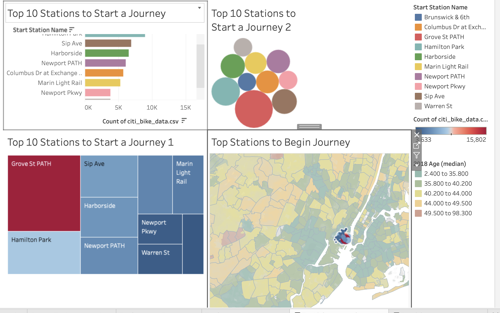
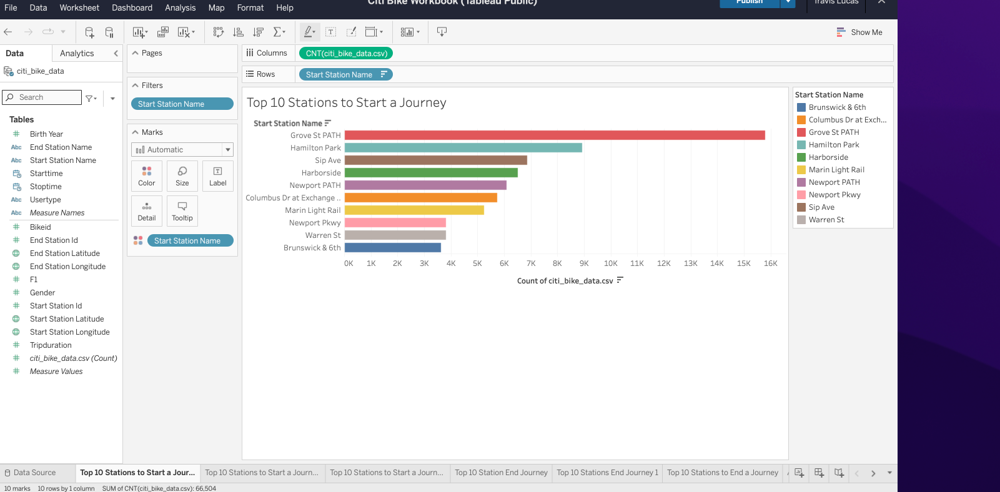
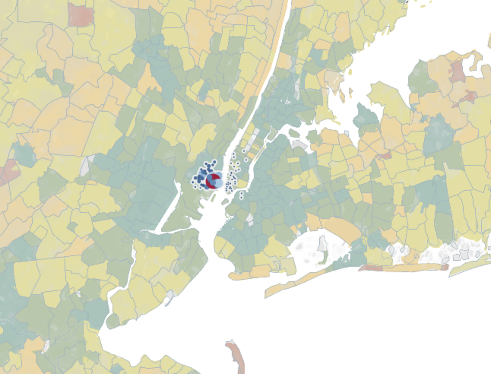

# Citi Bike Visualizations
Plots, Dashboards, and Stories with Tableau

## Table of Contents
* [General Info](#general_info)
* [Technologies](#technologies)
* [Setup](#Setup)
* [Features](Features)

## General Info
Analyze data from the New York Citi Bike Program and discover phenomena in the data set. Use Tableau to create visuals to show your conclusion.

## Technologies
* Tableau
* Pandas

## Setup
* Published on Tableau Public DeskTop

## Features
Top 10 Stations to Start a Journey Dashboard

Top 10 Stations to Start a Journey Graph

Map of Citi Bike stations sized by popularity

